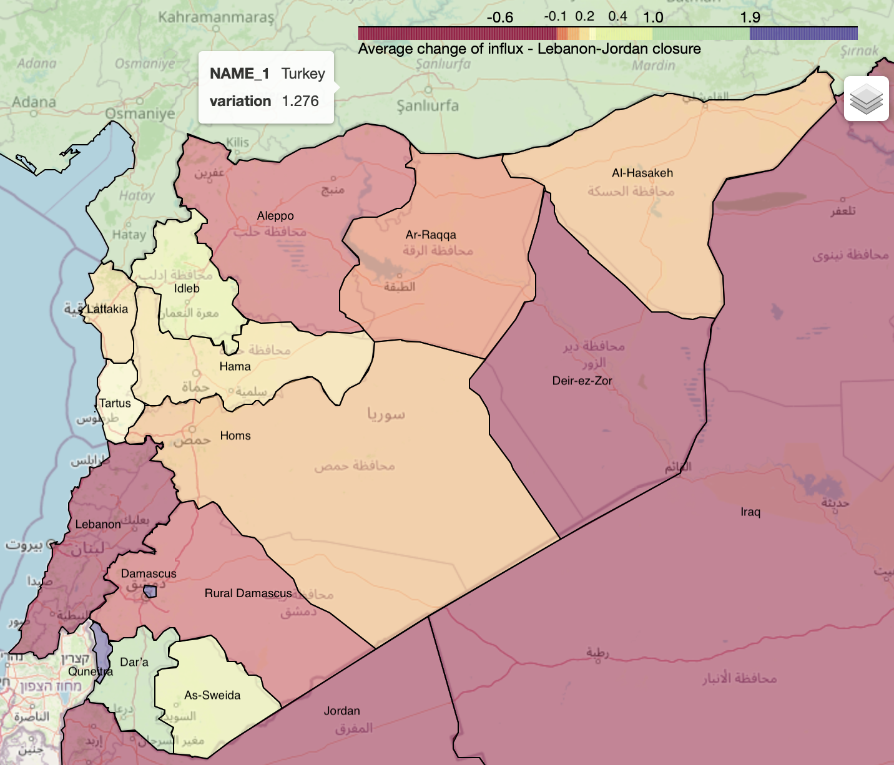

# visualising_Syrian_flow
This is a complementary repository to visualise the synthetic and empirical trends and maps of Syrian refugee movements. All of the figures in this paper as well as those in my thesis are plotted using the codes in the folder 'scripts' or variations of them.
***
## Authors

 * Zahra Jafari, <zahra.jafari.17@ucl.ac.uk>
   * UCL Jill Dando Institute of Security and Crime Science, University College London
 * Toby Davies,
   * UCL Jill Dando Institute of Security and Crime Science, University College London
 * Shane Johnson,
   * UCL Jill Dando Institute of Security and Crime Science, University College London

# Requirements

The project uses Python and the source code should run on any standard operating system (i.e. Linux/Unix, MacOS, Windows).

## Python Dependencies

 - Python3.6+
 - Other dependencies can be found in the `requirements.txt`.

 To install them run `pip3 install -r requirements.txt`.

# Content of the repository

## scripts
  - `map_destination_flow.py`
    - A module with the core functions to visualise map of destination flow
    ![Change of inflows as a result of border closure]
  - `destination-multi-data.py`
    - A module with the core functions to visualise simulated trends of destination flow against observed data
  - `correlogram.py`
    - A module with the core function to visualise correlations between changes of inflow corresponding to each pair of destinations
  - `summary.py`
    - A module with the core function to visualise summary of results from border closure experiments

## Directories

  - `flow_data`
    - This includes spatio-temporal output of the Syrian flow simulation. These data are visualised in many forms using the codes in the scripts directory.
### Input format

The temporal intervals are monthly. The directory includes csv files corresponding to displacement flows from or towards certain location at certain month. The temporal units are across the columns and the space is across the rows.

## Results

Simulation results are saved in html, pdf and png files.
